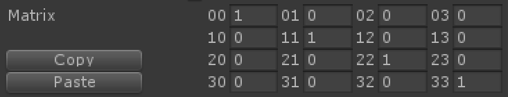
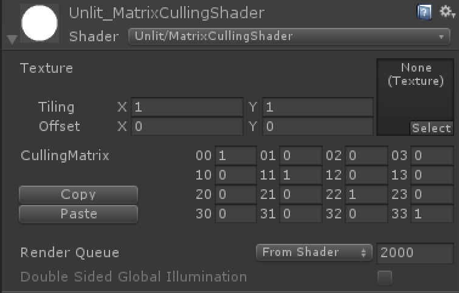

UnityMatrixTool

====

このツールは、Unityが提供している`Matrix4x4`型の値の作成、改造、シェーダー上での利用を容易にするためのツール群を目指して開発中です。

# 主な機能
## MatrixField

Matrixフィールドに`MatrixFieldAttribute`を付けることで、インスペクタ上での見た目がこのように変化します。各値が見やすくなる他、左側にあるボタンでMatrixの値を一括でコピー、ペーストすることができます。また、クリップボードに保存される値はcsvのフォーマットである為、適当なテキストエディタで作成、編集が可能です。

## SerializedMatrix

Materialにシリアライズされる形でMatrixを保持することができます。Vectorプロパティを4つ使用することで、シェーダー内およびインスペクタ上でMatrixとして扱うことが可能になる支援スクリプトを提供します。

## MatrixEditor
Matrixの値をSceneView上でプレビューしながら編集することが出来ます。作ったMatrixのコピーはもちろん、逆行列をコピーすることも出来ます。

## VRChat対応
本ツールは、VRChat環境上でシェーダーに対し軽率にMatrixを持たせたいという思いの元誕生しました。編集機能はEditorでしか使用できませんが、作成したMatrix及びシェーダーはVRChat上で使用可能です。

# 実装予定の機能(順不同)
- テストの作成
- サンプルの作成
- MatrixFieldの情報量拡充
    - セル単位でのMixedValue表示
- MatrixEditorの編集機能の充実
    - 錐台編集
    - TRSベースの編集
    - 頂点位置からの逆算
    - 他のメッシュでプレビュー
    - Matrix同士の演算
- SerializedMatrixの利用を楽にする
    - テンプレート作成
- Tips置き場
    - よく忘れるcolumn, rowが表す値、スウィズルなどの情報を置く場所を作りたい

